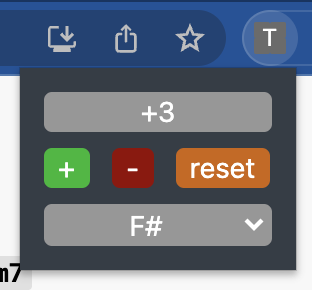
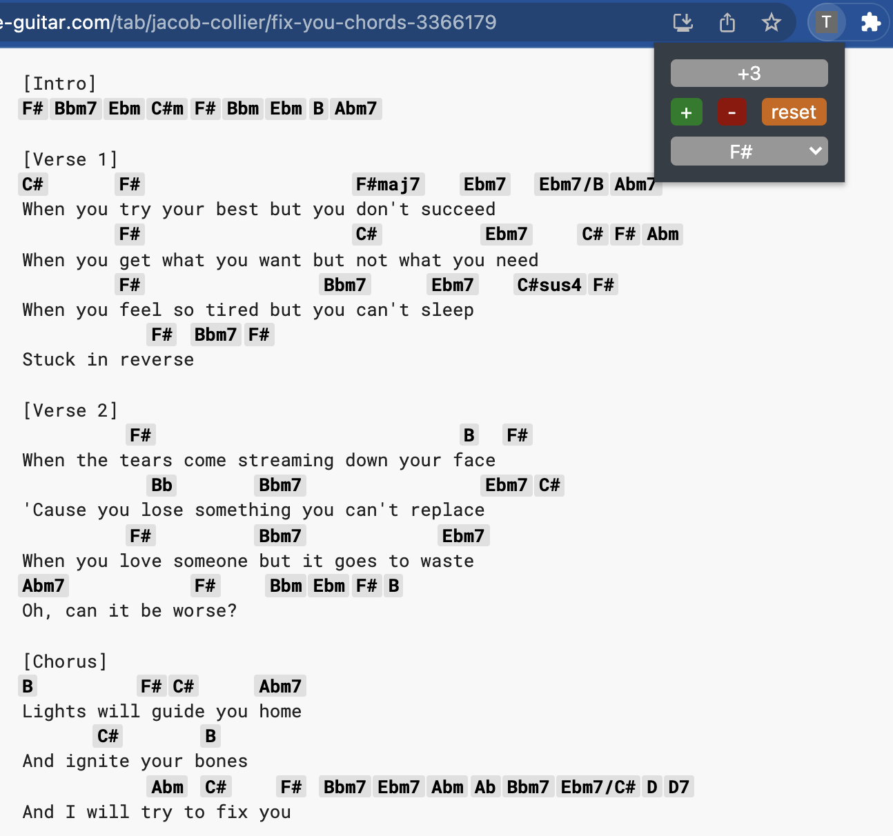

# transposer v0.0.0.1
Transposer is an open source Chrome Extension for quickly transposing chords on websites.

## Features
- Simple and quick way to tranpose all chords on a webpage to a new key:
    - Increase the key by one semitone (`Ctrl/Command+Shift+Up`)
    - Decrease the key by one semitone (`Ctrl/Command+Shift+Down`)
    - Tell transposer the current key and select a new key
- Automatically detects all chords:
    - Support for major, minor, diminished, added, sustained chords, chord inversions and more.
    - Does not modify other parts of a webpage
        - (e.g. the `Am` in `American` will not be detected as an A Minor chord)

## Purpose
- Musicians often use online chord sheets.
- Many websites force users to pay for automatic transposition.
- Transposer works on any site that embeds chords as text rather than graphics.
    - [Example](https://tabs.ultimate-guitar.com/tab/jacob-collier/fix-you-chords-3366179):

## Milestones

### High priority
- Create a working backend
    - Identify chords in a website :white_check_mark:
    - Transpose chords and replace original text :white_check_mark:
- Create a working frontend
    - Allow users to select an adjustment (up/down semitones) :white_check_mark:
    - Allow users to indicate the current key and select a new key :white_check_mark:
    - Allow users to see the offset from the original key :white_check_mark:
    - Allow users to return to the original key with a single click :white_check_mark:
    - Allow multiple instances of extension in different tabs/windows :white_check_mark:
    - Allow keyboard shortcuts to change the key :white_check_mark:
    - Provide a user friendly interface :white_check_mark:
    - Perform testing and resolve edge cases
- Publish on the Chrome Web Store

### Medium priority
- Make a clean UI :white_check_mark:
- Provide proper documentation for external contributors

### Low priority
- Automatically identify the original key of a song

## How You Can Contribute
Feel free to submit an issue / fork / pull request [here](https://github.com/itzblim/transposer/issues)!

*Built by [Benjamin Lim](https://github.com/itzblim)*
